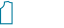

<h1 align="center"> teste feito para vaga de Front-End jr na empresa Fasters </h1>
<hr>

<p align="center">
  
   
</p>

<h2>Tópicos </h2> 

:small_blue_diamond: [Descrição do projeto](#descrição-do-projeto)

:small_blue_diamond: [Funcionalidades](#funcionalidades)

:small_blue_diamond: [Deploy da Aplicação](#deploy-da-aplicação-dash)


:small_blue_diamond: [Como rodar a aplicação](#como-rodar-a-aplicação-desktop_computer)

## Descrição do projeto 

<p align="justify">
  Landing page construída em React, html, css, bootstrap e js para testar conhecimentos para vaga de Front-End junior na empresa Fasters 
</p>

## Funcionalidades

:heavy_check_mark: Menu que troca de cor ao Scroll  

:heavy_check_mark: Menu Hambúrguer para dispositivos mobile

:heavy_check_mark: botão que volta ao topo da página com comportamento smooth  

:heavy_check_mark: Carrousel com testemunhas


## Como rodar a aplicação :desktop_computer:

No terminal, clone o projeto: 

```
git clone https://github.com/vitorvitorgregorio/ReneeTrajar.git
```

Entre na pasta do projeto pelo terminal: 

```
cd ReneeTrajar
```

Instale as dependências: 

```
npm install
```
ou
```
yarn install
```

Execute a aplicação: 

```
npm start
```
ou
```
yarn start
```
Pronto 😄, agora é possível acessar a aplicação a partir da rota: http://localhost:3000

## Linguagens, dependencias e libs utilizadas :books:

- [React](https://pt-br.reactjs.org/docs/create-a-new-react-app.html)
- [React PDF](https://react-pdf.org/)
- [Bootstrap](https://getbootstrap.com)


